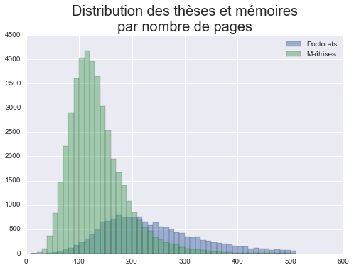
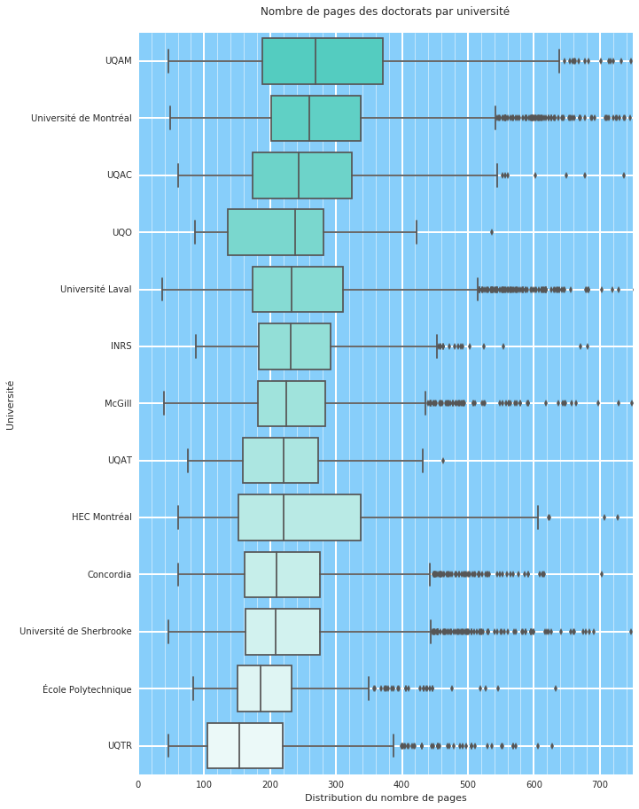
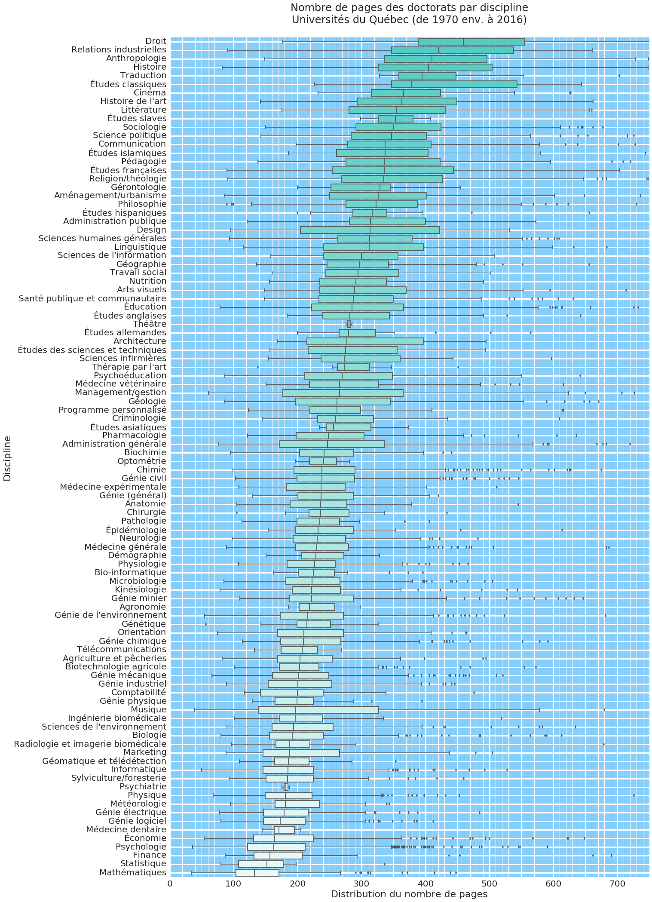
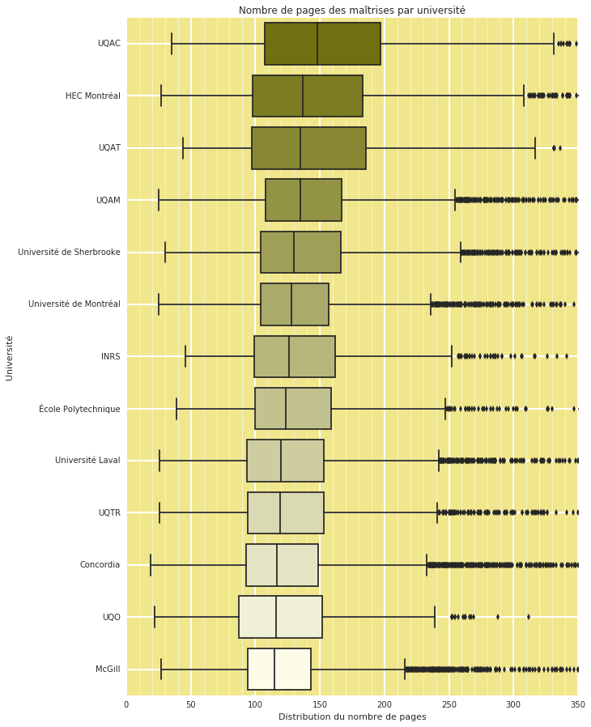
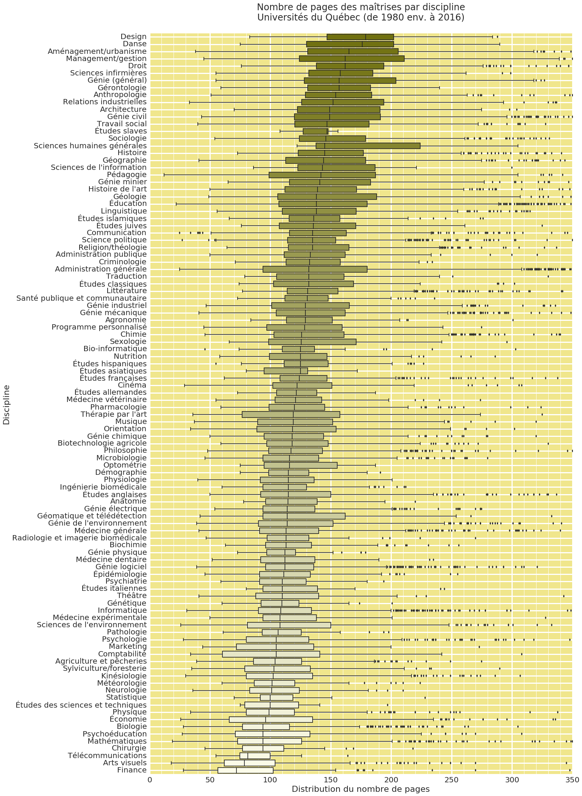
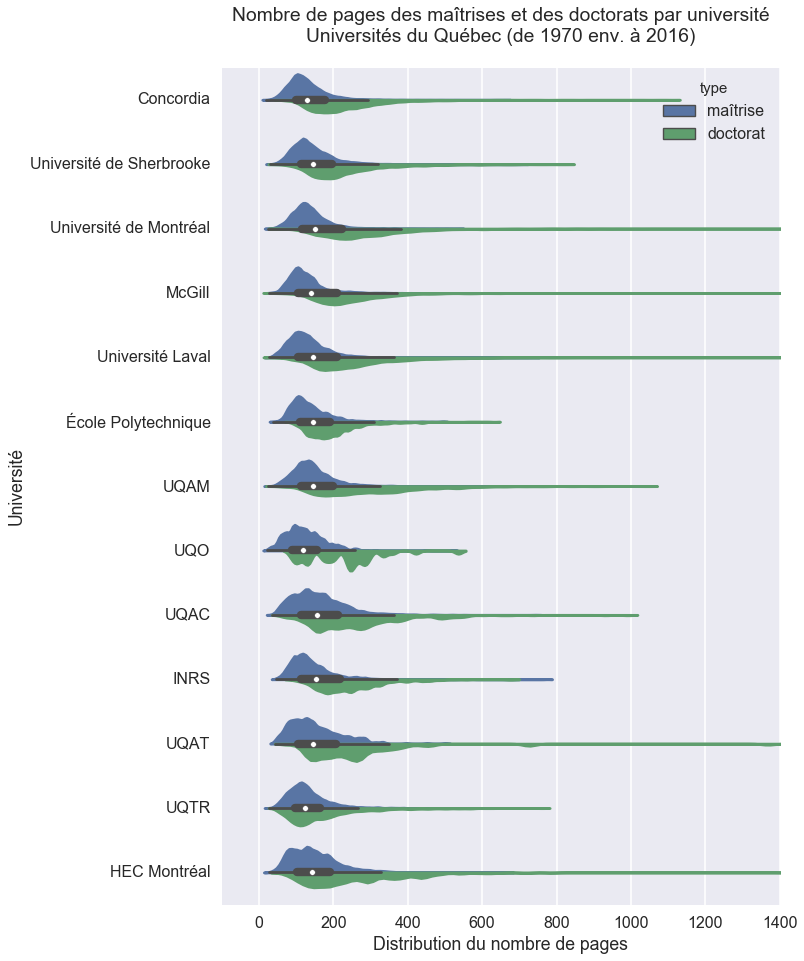

<h1 style="color:blue">Thèses et mémoires du Québec</h1>
### Quelques données sur les doctorats et maîtrises publiés dans les universités québécoises depuis les années 1970

----

#### *Data on theses and dissertations published in Québec universities in the last 50 years*


```python
%matplotlib inline
import csv, re, random
import pandas as pd
import numpy as np
import matplotlib as mpl
import matplotlib.pyplot as plt
from scipy import stats, integrate
import seaborn as sns
```

-----
On commence par demander à **pandas** d'avaler le fichier CSV qui contient toutes nos données et de les placer dans la variable `theses`.


```python
theses = pd.read_csv("THESES-TOTAL.csv")
```

-----
On fait ensuite, toujours grâce à pandas, une première analyse rapide du nombre de pages selon le type de document (doctorat ou maîtrise). Tout de suite, on a:

- le nombre total de documents dans chacun de ces deux types
- les valeurs extrêmes (min et max)
- la moyenne et la médiane (50%)
- une idée de la distribution du nombre de pages par quartile


```python
parType = theses.groupby("type").nbPages
parType.describe()
```


    type           
    doctorat  count    16175.000000
              mean       251.200000
              std        117.811595
              min         34.000000
              25%        172.000000
              50%        226.000000
              75%        303.000000
              max       1578.000000
    maîtrise  count    43541.000000
              mean       134.424313
              std         55.511239
              min         19.000000
              25%         98.000000
              50%        125.000000
              75%        159.000000
              max        776.000000
    dtype: float64


-----
On demande ensuite à **matplotlib** de faire un premier graphique. C'est un histogramme de la distribution du nombre de pages des maîtrises et doctorats par tranche de 10 pages, puisqu'on fait 50 colonnes (*«bins»*) dans un intervalle (*«range»*) qui va de 10 à 510. Le paramètre `alpha` indique que les colonnes auront une transparence de 50%.


```python
parType.hist(bins=50,histtype="bar",range=(10,510), alpha=0.5)
plt.legend(["Doctorats","Maîtrises"])
plt.title("Distribution des thèses et mémoires\npar nombre de pages",size=20)
```


    <matplotlib.text.Text at 0x1158b3d30>





-----

## Les doctorats

-----

Commençons par analyser seulement les doctorats en les regroupant tous dans une variable du même nom. Pandas peut nous décrire quelques-unes des données contenues dans ce sous-ensemble:

- l'année à laquelle le doctorat a été déposé
- son nombre de pages
- la longueur de son titre


```python
doctorats = theses.query("type == 'doctorat'")
doctorats.describe()
```


<div>
<table border="1" class="dataframe">
  <thead>
    <tr style="text-align: right;">
      <th></th>
      <th>annee</th>
      <th>octets</th>
      <th>nbPages</th>
      <th>longTitre</th>
    </tr>
  </thead>
  <tbody>
    <tr>
      <th>count</th>
      <td>16175.000000</td>
      <td>1.491500e+04</td>
      <td>16175.000000</td>
      <td>16175.000000</td>
    </tr>
    <tr>
      <th>mean</th>
      <td>2006.596662</td>
      <td>1.732706e+07</td>
      <td>251.200000</td>
      <td>105.367728</td>
    </tr>
    <tr>
      <th>std</th>
      <td>9.254433</td>
      <td>2.869095e+07</td>
      <td>117.811595</td>
      <td>41.261663</td>
    </tr>
    <tr>
      <th>min</th>
      <td>1966.000000</td>
      <td>5.946900e+04</td>
      <td>34.000000</td>
      <td>14.000000</td>
    </tr>
    <tr>
      <th>25%</th>
      <td>2004.000000</td>
      <td>4.125314e+06</td>
      <td>172.000000</td>
      <td>76.000000</td>
    </tr>
    <tr>
      <th>50%</th>
      <td>2010.000000</td>
      <td>7.931251e+06</td>
      <td>226.000000</td>
      <td>100.000000</td>
    </tr>
    <tr>
      <th>75%</th>
      <td>2013.000000</td>
      <td>1.637154e+07</td>
      <td>303.000000</td>
      <td>129.000000</td>
    </tr>
    <tr>
      <th>max</th>
      <td>2016.000000</td>
      <td>5.581489e+08</td>
      <td>1578.000000</td>
      <td>378.000000</td>
    </tr>
  </tbody>
</table>
</div>


-----
C'est bien d'avoir des données sur l'ensemble des doctorats au Québec. Mais je suis curieux de savoir comment le nombre de pages de ces doctorats varie en fonction de l'université dans laquelle ils ont été réalisés.

Pandas nous aide ici encore en permettant d'effectuer un regroupement par université que j'ai placé dans une variable appelée `doctoratsUniv`.


```python
doctoratsUniv = doctorats.groupby("universite")
doctoratsUniv.describe()
```


<div>
<table border="1" class="dataframe">
  <thead>
    <tr style="text-align: right;">
      <th></th>
      <th></th>
      <th>annee</th>
      <th>longTitre</th>
      <th>nbPages</th>
      <th>octets</th>
    </tr>
    <tr>
      <th>universite</th>
      <th></th>
      <th></th>
      <th></th>
      <th></th>
      <th></th>
    </tr>
  </thead>
  <tbody>
    <tr>
      <th rowspan="8" valign="top">Concordia</th>
      <th>count</th>
      <td>2162.000000</td>
      <td>2162.000000</td>
      <td>2162.000000</td>
      <td>2.140000e+03</td>
    </tr>
    <tr>
      <th>mean</th>
      <td>2004.987974</td>
      <td>89.526364</td>
      <td>230.700278</td>
      <td>8.534401e+06</td>
    </tr>
    <tr>
      <th>std</th>
      <td>7.950381</td>
      <td>34.425079</td>
      <td>97.808660</td>
      <td>8.593958e+06</td>
    </tr>
    <tr>
      <th>min</th>
      <td>1972.000000</td>
      <td>14.000000</td>
      <td>61.000000</td>
      <td>3.519070e+05</td>
    </tr>
    <tr>
      <th>25%</th>
      <td>1999.000000</td>
      <td>64.000000</td>
      <td>162.000000</td>
      <td>4.117314e+06</td>
    </tr>
    <tr>
      <th>50%</th>
      <td>2007.000000</td>
      <td>85.000000</td>
      <td>210.500000</td>
      <td>6.739082e+06</td>
    </tr>
    <tr>
      <th>75%</th>
      <td>2012.000000</td>
      <td>108.000000</td>
      <td>276.750000</td>
      <td>1.047380e+07</td>
    </tr>
    <tr>
      <th>max</th>
      <td>2015.000000</td>
      <td>261.000000</td>
      <td>1112.000000</td>
      <td>1.678755e+08</td>
    </tr>
    <tr>
      <th rowspan="8" valign="top">HEC Montréal</th>
      <th>count</th>
      <td>304.000000</td>
      <td>304.000000</td>
      <td>304.000000</td>
      <td>0.000000e+00</td>
    </tr>
    <tr>
      <th>mean</th>
      <td>2005.072368</td>
      <td>92.697368</td>
      <td>262.460526</td>
      <td>NaN</td>
    </tr>
    <tr>
      <th>std</th>
      <td>8.129401</td>
      <td>37.823551</td>
      <td>147.050602</td>
      <td>NaN</td>
    </tr>
    <tr>
      <th>min</th>
      <td>1970.000000</td>
      <td>26.000000</td>
      <td>61.000000</td>
      <td>NaN</td>
    </tr>
    <tr>
      <th>25%</th>
      <td>2001.000000</td>
      <td>62.000000</td>
      <td>157.750000</td>
      <td>NaN</td>
    </tr>
    <tr>
      <th>50%</th>
      <td>2007.000000</td>
      <td>89.000000</td>
      <td>226.000000</td>
      <td>NaN</td>
    </tr>
    <tr>
      <th>75%</th>
      <td>2012.000000</td>
      <td>118.000000</td>
      <td>340.250000</td>
      <td>NaN</td>
    </tr>
    <tr>
      <th>max</th>
      <td>2016.000000</td>
      <td>212.000000</td>
      <td>1430.000000</td>
      <td>NaN</td>
    </tr>
    <tr>
      <th rowspan="8" valign="top">INRS</th>
      <th>count</th>
      <td>506.000000</td>
      <td>506.000000</td>
      <td>506.000000</td>
      <td>4.800000e+02</td>
    </tr>
    <tr>
      <th>mean</th>
      <td>2007.750988</td>
      <td>122.173913</td>
      <td>246.189723</td>
      <td>2.394907e+07</td>
    </tr>
    <tr>
      <th>std</th>
      <td>6.281298</td>
      <td>40.401272</td>
      <td>88.376734</td>
      <td>3.148578e+07</td>
    </tr>
    <tr>
      <th>min</th>
      <td>1986.000000</td>
      <td>37.000000</td>
      <td>87.000000</td>
      <td>6.946860e+05</td>
    </tr>
    <tr>
      <th>25%</th>
      <td>2004.000000</td>
      <td>94.250000</td>
      <td>182.250000</td>
      <td>4.736097e+06</td>
    </tr>
    <tr>
      <th>50%</th>
      <td>2009.000000</td>
      <td>117.000000</td>
      <td>231.500000</td>
      <td>1.067114e+07</td>
    </tr>
    <tr>
      <th>75%</th>
      <td>2013.000000</td>
      <td>146.000000</td>
      <td>292.000000</td>
      <td>2.758995e+07</td>
    </tr>
    <tr>
      <th>max</th>
      <td>2016.000000</td>
      <td>303.000000</td>
      <td>682.000000</td>
      <td>2.037039e+08</td>
    </tr>
    <tr>
      <th rowspan="6" valign="top">McGill</th>
      <th>count</th>
      <td>2665.000000</td>
      <td>2665.000000</td>
      <td>2665.000000</td>
      <td>2.665000e+03</td>
    </tr>
    <tr>
      <th>mean</th>
      <td>1997.303940</td>
      <td>86.746341</td>
      <td>252.076173</td>
      <td>1.153565e+07</td>
    </tr>
    <tr>
      <th>std</th>
      <td>14.148104</td>
      <td>34.138719</td>
      <td>113.549763</td>
      <td>1.232778e+07</td>
    </tr>
    <tr>
      <th>min</th>
      <td>1966.000000</td>
      <td>14.000000</td>
      <td>34.000000</td>
      <td>4.112780e+05</td>
    </tr>
    <tr>
      <th>25%</th>
      <td>1987.000000</td>
      <td>62.000000</td>
      <td>182.000000</td>
      <td>5.463972e+06</td>
    </tr>
    <tr>
      <th>50%</th>
      <td>2000.000000</td>
      <td>83.000000</td>
      <td>228.000000</td>
      <td>9.004410e+06</td>
    </tr>
    <tr>
      <th>...</th>
      <th>...</th>
      <td>...</td>
      <td>...</td>
      <td>...</td>
      <td>...</td>
    </tr>
    <tr>
      <th rowspan="6" valign="top">Université Laval</th>
      <th>std</th>
      <td>3.235148</td>
      <td>41.835292</td>
      <td>120.192935</td>
      <td>4.534371e+07</td>
    </tr>
    <tr>
      <th>min</th>
      <td>2002.000000</td>
      <td>14.000000</td>
      <td>36.000000</td>
      <td>4.692270e+05</td>
    </tr>
    <tr>
      <th>25%</th>
      <td>2008.000000</td>
      <td>84.000000</td>
      <td>174.000000</td>
      <td>5.301769e+06</td>
    </tr>
    <tr>
      <th>50%</th>
      <td>2011.000000</td>
      <td>109.000000</td>
      <td>232.000000</td>
      <td>2.037965e+07</td>
    </tr>
    <tr>
      <th>75%</th>
      <td>2014.000000</td>
      <td>137.000000</td>
      <td>310.500000</td>
      <td>5.389918e+07</td>
    </tr>
    <tr>
      <th>max</th>
      <td>2016.000000</td>
      <td>378.000000</td>
      <td>1478.000000</td>
      <td>5.581489e+08</td>
    </tr>
    <tr>
      <th rowspan="8" valign="top">Université de Montréal</th>
      <th>count</th>
      <td>2676.000000</td>
      <td>2676.000000</td>
      <td>2676.000000</td>
      <td>2.676000e+03</td>
    </tr>
    <tr>
      <th>mean</th>
      <td>2009.778774</td>
      <td>109.508595</td>
      <td>282.806801</td>
      <td>9.019822e+06</td>
    </tr>
    <tr>
      <th>std</th>
      <td>4.929902</td>
      <td>38.674693</td>
      <td>121.275155</td>
      <td>1.787053e+07</td>
    </tr>
    <tr>
      <th>min</th>
      <td>1970.000000</td>
      <td>21.000000</td>
      <td>49.000000</td>
      <td>1.110980e+05</td>
    </tr>
    <tr>
      <th>25%</th>
      <td>2008.000000</td>
      <td>81.000000</td>
      <td>201.000000</td>
      <td>2.194149e+06</td>
    </tr>
    <tr>
      <th>50%</th>
      <td>2010.000000</td>
      <td>107.000000</td>
      <td>259.000000</td>
      <td>4.303511e+06</td>
    </tr>
    <tr>
      <th>75%</th>
      <td>2013.000000</td>
      <td>135.000000</td>
      <td>337.250000</td>
      <td>8.560010e+06</td>
    </tr>
    <tr>
      <th>max</th>
      <td>2015.000000</td>
      <td>259.000000</td>
      <td>1578.000000</td>
      <td>3.339740e+08</td>
    </tr>
    <tr>
      <th rowspan="8" valign="top">Université de Sherbrooke</th>
      <th>count</th>
      <td>1728.000000</td>
      <td>1728.000000</td>
      <td>1728.000000</td>
      <td>1.728000e+03</td>
    </tr>
    <tr>
      <th>mean</th>
      <td>2008.038773</td>
      <td>117.899306</td>
      <td>234.346065</td>
      <td>1.661539e+07</td>
    </tr>
    <tr>
      <th>std</th>
      <td>5.933740</td>
      <td>43.135735</td>
      <td>105.779646</td>
      <td>3.248008e+07</td>
    </tr>
    <tr>
      <th>min</th>
      <td>1975.000000</td>
      <td>21.000000</td>
      <td>46.000000</td>
      <td>5.946900e+04</td>
    </tr>
    <tr>
      <th>25%</th>
      <td>2004.000000</td>
      <td>88.000000</td>
      <td>163.000000</td>
      <td>5.510396e+06</td>
    </tr>
    <tr>
      <th>50%</th>
      <td>2009.000000</td>
      <td>111.000000</td>
      <td>208.000000</td>
      <td>8.374180e+06</td>
    </tr>
    <tr>
      <th>75%</th>
      <td>2013.000000</td>
      <td>142.000000</td>
      <td>276.000000</td>
      <td>1.287293e+07</td>
    </tr>
    <tr>
      <th>max</th>
      <td>2016.000000</td>
      <td>351.000000</td>
      <td>826.000000</td>
      <td>3.400589e+08</td>
    </tr>
    <tr>
      <th rowspan="8" valign="top">École Polytechnique</th>
      <th>count</th>
      <td>576.000000</td>
      <td>576.000000</td>
      <td>576.000000</td>
      <td>5.760000e+02</td>
    </tr>
    <tr>
      <th>mean</th>
      <td>2012.612847</td>
      <td>96.097222</td>
      <td>201.854167</td>
      <td>8.199000e+06</td>
    </tr>
    <tr>
      <th>std</th>
      <td>1.856910</td>
      <td>31.753029</td>
      <td>74.976446</td>
      <td>1.215289e+07</td>
    </tr>
    <tr>
      <th>min</th>
      <td>2009.000000</td>
      <td>25.000000</td>
      <td>84.000000</td>
      <td>5.815810e+05</td>
    </tr>
    <tr>
      <th>25%</th>
      <td>2011.000000</td>
      <td>73.000000</td>
      <td>151.000000</td>
      <td>2.738251e+06</td>
    </tr>
    <tr>
      <th>50%</th>
      <td>2013.000000</td>
      <td>93.000000</td>
      <td>186.000000</td>
      <td>5.302887e+06</td>
    </tr>
    <tr>
      <th>75%</th>
      <td>2014.000000</td>
      <td>115.250000</td>
      <td>233.000000</td>
      <td>9.444866e+06</td>
    </tr>
    <tr>
      <th>max</th>
      <td>2016.000000</td>
      <td>200.000000</td>
      <td>633.000000</td>
      <td>2.049431e+08</td>
    </tr>
  </tbody>
</table>
<p>104 rows × 4 columns</p>
</div>


-----
Classons maintenant les universités en fonction du nombre médian de pages de leurs doctorats, exercice intéressant en soi qui sera également utile pour l'étape suivante.


```python
medianesDoctoratsUniv = doctoratsUniv["nbPages"].median().sort_values(ascending=False)
medianesDoctoratsUniv
```


    universite
    UQAM                        269.0
    Université de Montréal      259.0
    UQAC                        242.5
    UQO                         238.5
    UQAT                        238.5
    Université Laval            232.0
    INRS                        231.5
    McGill                      228.0
    HEC Montréal                226.0
    Concordia                   210.5
    Université de Sherbrooke    208.0
    École Polytechnique         186.0
    UQTR                        145.0
    Name: nbPages, dtype: float64


-----
Pour illustrer la distribution du nombre de pages des doctorats par université, le meilleur type de graphique est peut-être le *box&nbsp;plot*, qu'on peut traduire par **diagramme de quartiles**... ou ce que les Français ont baptisé des [boîtes à moustaches](https://fr.wikipedia.org/wiki/Bo%C3%AEte_%C3%A0_moustaches).


Ces boîtes permettent d'afficher une distribution qui a été découpée en quartiles.<br>
Les deuxième et troisième quartiles, ceux qui se trouvent de part et d'autre de la médiane, sont représentés par deux rectangles, les boîtes.<br>
Les premier et dernier quartiles sont, quant à eux, représentés par des lignes, les moustaches.<br>
Des valeurs excentriques peuvent enfin être représentés par des points à gauche ou à droite des lignes.

J'ai essayé d'utiliser le [langage R](https://cran.r-project.org/doc/contrib/Goulet_introduction_programmation_R.pdf) pour en produire, comme l'a fait [Markus Beck](https://beckmw.wordpress.com/2014/07/15/average-dissertation-and-thesis-length-take-two/). Mais j'ai été incapable d'arriver à des résultats satisfaisants.

Après avoir essayé les librairies [matplotlib](http://matplotlib.org/) et [bokeh](http://bokeh.pydata.org/en/latest/), j'ai trouvé [seaborn](https://stanford.edu/~mwaskom/software/seaborn/) beaucoup plus facile à utiliser.<br>
Le code ci-dessous est relativement facile à comprendre. Matplotlib contrôle la taille finale du graphique au moyen de la méthode `plt.figure`, puis seaborn fait tout le reste. On remarque notamment que la méthode `sns.boxplot` a un paramètre qui permet d'ordonner nos boîtes (`order`), paramètre que j'ai alimenté avec l'index de la variable `medianesDoctoratsUniv` créé juste ci-dessus.

Au final, on a une idée de la distribution du nombre de pages des doctorats, par université. C'est à l'UQAM que les professeurs travaillent le plus (si on se fie au nombre de pages qu'ils doivent lire)... ou le moins (si on se fie au nombre de pages qu'ils laissent leurs doctorants écrire).


```python
sns.set()
plt.figure(figsize=(10, 15))
sns.set_style("darkgrid", {
        "axes.facecolor": "lightskyblue",
        "font.family": [u"Bitstream Vera Sans"]
    })
couleurs = sns.light_palette("turquoise", n_colors=13, reverse=True)
boiteDoc = sns.boxplot(y="universite",
                       x="nbPages",
                       data=doctorats,
                       palette=couleurs,
                       order=medianesDoctoratsUniv.index
                      )
boiteDoc.get_xaxis().set_minor_locator(mpl.ticker.AutoMinorLocator())
boiteDoc.grid(b=True, which='major', color='w', linewidth=2.0)
boiteDoc.grid(b=True, which='minor', color='w', linewidth=0.5)
boiteDoc.set(ylabel="Université",
             xlabel="Distribution du nombre de pages",
             xlim=(0,750),
             title="Nombre de pages des doctorats par université\n"
            )
```


    [<matplotlib.text.Text at 0x11f606e10>,
     (0, 750),
     <matplotlib.text.Text at 0x11f60d6d8>,
     <matplotlib.text.Text at 0x11f62cd68>]





-----
On peut aussi créer un autre graphique à moustaches intéressant en regroupant les doctorats par discipline, plutôt que par université.<br>
On commence par créer une variable qui va nous permetter d'ordonner les disciplines en fonction de la médiane du nombre de pages (`medianesDoctoratsDiscipline`).


```python
doctoratsDiscipline = doctorats.groupby("discipline")
medianesDoctoratsDiscipline = doctoratsDiscipline["nbPages"].median().sort_values(ascending=False)
medianesDoctoratsDiscipline
```


    discipline
    Droit                                 459.0
    Relations industrielles               420.0
    Anthropologie                         410.0
    Histoire                              405.0
    Traduction                            394.5
    Études classiques                     378.0
    Cinéma                                366.0
    Histoire de l'art                     363.0
    Littérature                           355.0
    Études slaves                         353.0
    Sociologie                            350.5
    Science politique                     347.0
    Communication                         337.0
    Études islamiques                     337.0
    Pédagogie                             336.0
    Études françaises                     336.0
    Religion/théologie                    335.0
    Gérontologie                          329.0
    Aménagement/urbanisme                 326.0
    Philosophie                           323.0
    Études hispaniques                    316.5
    Administration publique               314.0
    Design                                313.5
    Sciences humaines générales           313.0
    Linguistique                          312.0
    Sciences de l'information             300.0
    Géographie                            296.5
    Travail social                        294.5
    Nutrition                             291.5
    Arts visuels                          289.0
                                          ...  
    Génétique                             215.0
    Orientation                           210.0
    Génie chimique                        209.0
    Télécommunications                    207.0
    Agriculture et pêcheries              204.0
    Biotechnologie agricole               203.0
    Génie mécanique                       202.0
    Génie industriel                      200.5
    Comptabilité                          200.0
    Génie physique                        199.0
    Musique                               197.0
    Ingénierie biomédicale                196.5
    Sciences de l'environnement           194.0
    Biologie                              192.0
    Radiologie et imagerie biomédicale    188.0
    Marketing                             187.5
    Géomatique et télédétection           185.5
    Informatique                          185.0
    Sylviculture/foresterie               184.5
    Psychiatrie                           182.0
    Physique                              181.0
    Météorologie                          181.0
    Génie électrique                      179.0
    Génie logiciel                        173.0
    Médecine dentaire                     171.0
    Économie                              164.5
    Psychologie                           163.0
    Finance                               157.0
    Statistique                           152.0
    Mathématiques                         133.0
    Name: nbPages, dtype: float64


-----
Puis on fait un diagramme par quartiles de la même façon qu'on vient de le faire avec les universités.<br>
Le résultat est un graphique complexe, mais riche en information. C'est en droit que les doctorants sont le plus prolixes, alors que les mathématiciens et statisticiens ont davantage l'habitude d'être *right to the point*.


```python
sns.set()
sns.set_context("poster")
sns.set(font_scale=2)
plt.figure(figsize=(20, 35))
sns.set_style("darkgrid", {
        "axes.facecolor": "lightskyblue",
        "font.family": [u"Bitstream Vera Sans"]
    })
couleurs = sns.light_palette("turquoise", n_colors=99, reverse=True)
boiteDoc = sns.boxplot(y="discipline",
                       x="nbPages",
                       data=doctorats,
                       palette=couleurs,
                       order=medianesDoctoratsDiscipline.index
                      )
boiteDoc.get_xaxis().set_minor_locator(mpl.ticker.AutoMinorLocator(n=10))
boiteDoc.grid(b=True, which='major', color='w', linewidth=3.0)
boiteDoc.grid(b=True, which='minor', color='w', linewidth=1)
boiteDoc.set(ylabel="Discipline",
             xlabel="Distribution du nombre de pages",
             xlim=(0,750),
             title="Nombre de pages des doctorats par discipline\nUniversités du Québec (de 1970 env. à 2016)\n"
            )
```


    [<matplotlib.text.Text at 0x1159b4518>,
     (0, 750),
     <matplotlib.text.Text at 0x11917af60>,
     <matplotlib.text.Text at 0x1195a6b38>]





-----

## Les maîtrises

-----

On peut maintenant faire la même chose pour les maîtrises en suivant exactement les mêmes étapes.


```python
maitrises = theses.query("type == 'maîtrise'")
maitrises.describe()
```


<div>
<table border="1" class="dataframe">
  <thead>
    <tr style="text-align: right;">
      <th></th>
      <th>annee</th>
      <th>octets</th>
      <th>nbPages</th>
      <th>longTitre</th>
    </tr>
  </thead>
  <tbody>
    <tr>
      <th>count</th>
      <td>43541.000000</td>
      <td>3.732400e+04</td>
      <td>43541.000000</td>
      <td>43541.000000</td>
    </tr>
    <tr>
      <th>mean</th>
      <td>2005.204244</td>
      <td>8.792853e+06</td>
      <td>134.424313</td>
      <td>100.840128</td>
    </tr>
    <tr>
      <th>std</th>
      <td>9.199370</td>
      <td>1.852868e+07</td>
      <td>55.511239</td>
      <td>39.285272</td>
    </tr>
    <tr>
      <th>min</th>
      <td>1965.000000</td>
      <td>9.075000e+03</td>
      <td>19.000000</td>
      <td>4.000000</td>
    </tr>
    <tr>
      <th>25%</th>
      <td>2002.000000</td>
      <td>2.410020e+06</td>
      <td>98.000000</td>
      <td>73.000000</td>
    </tr>
    <tr>
      <th>50%</th>
      <td>2008.000000</td>
      <td>4.296643e+06</td>
      <td>125.000000</td>
      <td>96.000000</td>
    </tr>
    <tr>
      <th>75%</th>
      <td>2012.000000</td>
      <td>8.060541e+06</td>
      <td>159.000000</td>
      <td>124.000000</td>
    </tr>
    <tr>
      <th>max</th>
      <td>2016.000000</td>
      <td>1.916892e+09</td>
      <td>776.000000</td>
      <td>345.000000</td>
    </tr>
  </tbody>
</table>
</div>


```python
maitrisesUniv = maitrises.groupby("universite")
maitrisesUniv.describe()
```


<div>
<table border="1" class="dataframe">
  <thead>
    <tr style="text-align: right;">
      <th></th>
      <th></th>
      <th>annee</th>
      <th>longTitre</th>
      <th>nbPages</th>
      <th>octets</th>
    </tr>
    <tr>
      <th>universite</th>
      <th></th>
      <th></th>
      <th></th>
      <th></th>
      <th></th>
    </tr>
  </thead>
  <tbody>
    <tr>
      <th rowspan="8" valign="top">Concordia</th>
      <th>count</th>
      <td>7635.000000</td>
      <td>7635.000000</td>
      <td>7635.000000</td>
      <td>7.572000e+03</td>
    </tr>
    <tr>
      <th>mean</th>
      <td>2003.431958</td>
      <td>82.973674</td>
      <td>126.218730</td>
      <td>5.212281e+06</td>
    </tr>
    <tr>
      <th>std</th>
      <td>8.682396</td>
      <td>33.049842</td>
      <td>50.820773</td>
      <td>2.404538e+07</td>
    </tr>
    <tr>
      <th>min</th>
      <td>1967.000000</td>
      <td>4.000000</td>
      <td>19.000000</td>
      <td>9.075000e+03</td>
    </tr>
    <tr>
      <th>25%</th>
      <td>1998.000000</td>
      <td>61.000000</td>
      <td>93.000000</td>
      <td>2.473654e+06</td>
    </tr>
    <tr>
      <th>50%</th>
      <td>2005.000000</td>
      <td>80.000000</td>
      <td>117.000000</td>
      <td>3.908633e+06</td>
    </tr>
    <tr>
      <th>75%</th>
      <td>2010.000000</td>
      <td>103.000000</td>
      <td>149.000000</td>
      <td>5.795650e+06</td>
    </tr>
    <tr>
      <th>max</th>
      <td>2016.000000</td>
      <td>298.000000</td>
      <td>666.000000</td>
      <td>1.916892e+09</td>
    </tr>
    <tr>
      <th rowspan="8" valign="top">HEC Montréal</th>
      <th>count</th>
      <td>2752.000000</td>
      <td>2752.000000</td>
      <td>2752.000000</td>
      <td>0.000000e+00</td>
    </tr>
    <tr>
      <th>mean</th>
      <td>2004.394985</td>
      <td>98.805596</td>
      <td>148.677326</td>
      <td>NaN</td>
    </tr>
    <tr>
      <th>std</th>
      <td>6.261178</td>
      <td>35.595852</td>
      <td>69.273289</td>
      <td>NaN</td>
    </tr>
    <tr>
      <th>min</th>
      <td>1981.000000</td>
      <td>21.000000</td>
      <td>27.000000</td>
      <td>NaN</td>
    </tr>
    <tr>
      <th>25%</th>
      <td>2001.000000</td>
      <td>74.000000</td>
      <td>98.000000</td>
      <td>NaN</td>
    </tr>
    <tr>
      <th>50%</th>
      <td>2005.000000</td>
      <td>94.000000</td>
      <td>137.000000</td>
      <td>NaN</td>
    </tr>
    <tr>
      <th>75%</th>
      <td>2009.000000</td>
      <td>119.000000</td>
      <td>183.000000</td>
      <td>NaN</td>
    </tr>
    <tr>
      <th>max</th>
      <td>2015.000000</td>
      <td>289.000000</td>
      <td>671.000000</td>
      <td>NaN</td>
    </tr>
    <tr>
      <th rowspan="8" valign="top">INRS</th>
      <th>count</th>
      <td>918.000000</td>
      <td>918.000000</td>
      <td>918.000000</td>
      <td>8.680000e+02</td>
    </tr>
    <tr>
      <th>mean</th>
      <td>2004.844227</td>
      <td>117.749455</td>
      <td>138.529412</td>
      <td>1.586013e+07</td>
    </tr>
    <tr>
      <th>std</th>
      <td>8.143527</td>
      <td>37.944952</td>
      <td>60.024393</td>
      <td>2.212764e+07</td>
    </tr>
    <tr>
      <th>min</th>
      <td>1980.000000</td>
      <td>39.000000</td>
      <td>46.000000</td>
      <td>4.846760e+05</td>
    </tr>
    <tr>
      <th>25%</th>
      <td>2002.000000</td>
      <td>89.000000</td>
      <td>99.250000</td>
      <td>2.274476e+06</td>
    </tr>
    <tr>
      <th>50%</th>
      <td>2006.000000</td>
      <td>114.000000</td>
      <td>126.000000</td>
      <td>5.926222e+06</td>
    </tr>
    <tr>
      <th>75%</th>
      <td>2011.000000</td>
      <td>141.000000</td>
      <td>162.000000</td>
      <td>1.965946e+07</td>
    </tr>
    <tr>
      <th>max</th>
      <td>2016.000000</td>
      <td>259.000000</td>
      <td>776.000000</td>
      <td>2.258889e+08</td>
    </tr>
    <tr>
      <th rowspan="6" valign="top">McGill</th>
      <th>count</th>
      <td>4707.000000</td>
      <td>4707.000000</td>
      <td>4707.000000</td>
      <td>4.707000e+03</td>
    </tr>
    <tr>
      <th>mean</th>
      <td>1995.230083</td>
      <td>83.101763</td>
      <td>124.154238</td>
      <td>5.803668e+06</td>
    </tr>
    <tr>
      <th>std</th>
      <td>14.022353</td>
      <td>33.238671</td>
      <td>48.615717</td>
      <td>1.218299e+07</td>
    </tr>
    <tr>
      <th>min</th>
      <td>1966.000000</td>
      <td>9.000000</td>
      <td>27.000000</td>
      <td>1.148270e+05</td>
    </tr>
    <tr>
      <th>25%</th>
      <td>1985.000000</td>
      <td>59.000000</td>
      <td>94.000000</td>
      <td>2.972332e+06</td>
    </tr>
    <tr>
      <th>50%</th>
      <td>1997.000000</td>
      <td>78.000000</td>
      <td>115.000000</td>
      <td>4.607944e+06</td>
    </tr>
    <tr>
      <th>...</th>
      <th>...</th>
      <td>...</td>
      <td>...</td>
      <td>...</td>
      <td>...</td>
    </tr>
    <tr>
      <th rowspan="6" valign="top">Université Laval</th>
      <th>std</th>
      <td>3.094363</td>
      <td>39.890720</td>
      <td>53.539320</td>
      <td>1.939081e+07</td>
    </tr>
    <tr>
      <th>min</th>
      <td>2003.000000</td>
      <td>6.000000</td>
      <td>26.000000</td>
      <td>2.191560e+05</td>
    </tr>
    <tr>
      <th>25%</th>
      <td>2008.000000</td>
      <td>82.000000</td>
      <td>93.500000</td>
      <td>3.310624e+06</td>
    </tr>
    <tr>
      <th>50%</th>
      <td>2010.000000</td>
      <td>106.000000</td>
      <td>120.000000</td>
      <td>1.363568e+07</td>
    </tr>
    <tr>
      <th>75%</th>
      <td>2013.000000</td>
      <td>133.000000</td>
      <td>153.000000</td>
      <td>2.798163e+07</td>
    </tr>
    <tr>
      <th>max</th>
      <td>2016.000000</td>
      <td>345.000000</td>
      <td>743.000000</td>
      <td>2.655805e+08</td>
    </tr>
    <tr>
      <th rowspan="8" valign="top">Université de Montréal</th>
      <th>count</th>
      <td>5473.000000</td>
      <td>5473.000000</td>
      <td>5473.000000</td>
      <td>5.473000e+03</td>
    </tr>
    <tr>
      <th>mean</th>
      <td>2009.435593</td>
      <td>105.431573</td>
      <td>134.880322</td>
      <td>4.493519e+06</td>
    </tr>
    <tr>
      <th>std</th>
      <td>4.978674</td>
      <td>36.490893</td>
      <td>48.302509</td>
      <td>1.166964e+07</td>
    </tr>
    <tr>
      <th>min</th>
      <td>1976.000000</td>
      <td>13.000000</td>
      <td>25.000000</td>
      <td>6.659300e+04</td>
    </tr>
    <tr>
      <th>25%</th>
      <td>2008.000000</td>
      <td>79.000000</td>
      <td>104.000000</td>
      <td>1.092832e+06</td>
    </tr>
    <tr>
      <th>50%</th>
      <td>2010.000000</td>
      <td>103.000000</td>
      <td>128.000000</td>
      <td>2.107427e+06</td>
    </tr>
    <tr>
      <th>75%</th>
      <td>2013.000000</td>
      <td>129.000000</td>
      <td>157.000000</td>
      <td>4.037837e+06</td>
    </tr>
    <tr>
      <th>max</th>
      <td>2015.000000</td>
      <td>288.000000</td>
      <td>541.000000</td>
      <td>2.880010e+08</td>
    </tr>
    <tr>
      <th rowspan="8" valign="top">Université de Sherbrooke</th>
      <th>count</th>
      <td>4749.000000</td>
      <td>4749.000000</td>
      <td>4749.000000</td>
      <td>4.749000e+03</td>
    </tr>
    <tr>
      <th>mean</th>
      <td>2005.481154</td>
      <td>110.097915</td>
      <td>140.593178</td>
      <td>1.085390e+07</td>
    </tr>
    <tr>
      <th>std</th>
      <td>7.199638</td>
      <td>39.911442</td>
      <td>55.388997</td>
      <td>2.093899e+07</td>
    </tr>
    <tr>
      <th>min</th>
      <td>1965.000000</td>
      <td>14.000000</td>
      <td>30.000000</td>
      <td>3.310720e+05</td>
    </tr>
    <tr>
      <th>25%</th>
      <td>2000.000000</td>
      <td>82.000000</td>
      <td>104.000000</td>
      <td>3.342797e+06</td>
    </tr>
    <tr>
      <th>50%</th>
      <td>2006.000000</td>
      <td>106.000000</td>
      <td>130.000000</td>
      <td>5.232517e+06</td>
    </tr>
    <tr>
      <th>75%</th>
      <td>2011.000000</td>
      <td>133.000000</td>
      <td>166.000000</td>
      <td>7.981370e+06</td>
    </tr>
    <tr>
      <th>max</th>
      <td>2016.000000</td>
      <td>305.000000</td>
      <td>712.000000</td>
      <td>6.318229e+08</td>
    </tr>
    <tr>
      <th rowspan="8" valign="top">École Polytechnique</th>
      <th>count</th>
      <td>1046.000000</td>
      <td>1046.000000</td>
      <td>1046.000000</td>
      <td>1.046000e+03</td>
    </tr>
    <tr>
      <th>mean</th>
      <td>2012.322180</td>
      <td>99.830784</td>
      <td>135.810707</td>
      <td>7.651716e+06</td>
    </tr>
    <tr>
      <th>std</th>
      <td>1.838042</td>
      <td>30.244159</td>
      <td>53.423384</td>
      <td>2.009079e+07</td>
    </tr>
    <tr>
      <th>min</th>
      <td>2009.000000</td>
      <td>26.000000</td>
      <td>39.000000</td>
      <td>2.678300e+05</td>
    </tr>
    <tr>
      <th>25%</th>
      <td>2011.000000</td>
      <td>79.000000</td>
      <td>100.000000</td>
      <td>2.059766e+06</td>
    </tr>
    <tr>
      <th>50%</th>
      <td>2012.000000</td>
      <td>96.000000</td>
      <td>123.500000</td>
      <td>3.616986e+06</td>
    </tr>
    <tr>
      <th>75%</th>
      <td>2014.000000</td>
      <td>118.000000</td>
      <td>159.000000</td>
      <td>7.254857e+06</td>
    </tr>
    <tr>
      <th>max</th>
      <td>2016.000000</td>
      <td>195.000000</td>
      <td>496.000000</td>
      <td>4.822821e+08</td>
    </tr>
  </tbody>
</table>
<p>104 rows × 4 columns</p>
</div>


```python
medianesMaitrisesUniv = maitrises.groupby("universite")["nbPages"].median().sort_values(ascending=False)
medianesMaitrisesUniv
```


    universite
    UQAC                        148.0
    HEC Montréal                137.0
    UQAT                        135.0
    UQAM                        135.0
    Université de Sherbrooke    130.0
    Université de Montréal      128.0
    INRS                        126.0
    École Polytechnique         123.5
    Université Laval            120.0
    UQTR                        119.5
    Concordia                   117.0
    UQO                         116.0
    McGill                      115.0
    Name: nbPages, dtype: float64


```python
sns.set()
plt.figure(figsize=(10, 15))
sns.set_style("darkgrid", {
        "axes.facecolor": "khaki",
        "font.family": [u"Bitstream Vera Sans"]
    })
couleurs = sns.light_palette("olive", n_colors=13, reverse=True)
boiteDoc = sns.boxplot(y="universite",
                       x="nbPages",
                       data=maitrises,
                       palette=couleurs,
                       order=medianesMaitrisesUniv.index
                      )
boiteDoc.get_xaxis().set_minor_locator(mpl.ticker.AutoMinorLocator())
boiteDoc.grid(b=True, which='major', color='w', linewidth=2.0)
boiteDoc.grid(b=True, which='minor', color='w', linewidth=0.5)
boiteDoc.set(ylabel="Université",
             xlabel="Distribution du nombre de pages",
             xlim=(0,350),
             title="Nombre de pages des maîtrises par université\n"
            )
```


    [<matplotlib.text.Text at 0x11f8f2320>,
     (0, 350),
     <matplotlib.text.Text at 0x11f876f98>,
     <matplotlib.text.Text at 0x11f8ffb70>]





```python
medianesMaitrisesDiscipline = maitrises.groupby("discipline")["nbPages"].median().sort_values(ascending=False)
medianesMaitrisesDiscipline
```


    discipline
    Design                               179.0
    Danse                                176.0
    Aménagement/urbanisme                165.0
    Management/gestion                   162.0
    Droit                                162.0
    Sciences infirmières                 158.0
    Génie (général)                      157.0
    Gérontologie                         157.0
    Anthropologie                        154.0
    Relations industrielles              152.0
    Architecture                         149.0
    Génie civil                          149.0
    Travail social                       147.0
    Études slaves                        147.0
    Sociologie                           146.0
    Sciences humaines générales          145.0
    Histoire                             145.0
    Géographie                           144.0
    Sciences de l'information            143.0
    Pédagogie                            142.5
    Génie minier                         141.0
    Histoire de l'art                    139.0
    Géologie                             138.0
    Éducation                            138.0
    Linguistique                         138.0
    Études islamiques                    136.0
    Études juives                        135.5
    Communication                        135.0
    Science politique                    135.0
    Religion/théologie                   135.0
                                         ...  
    Médecine dentaire                    112.0
    Génie logiciel                       112.0
    Épidémiologie                        111.0
    Psychiatrie                          110.0
    Études italiennes                    110.0
    Théâtre                              110.0
    Génétique                            109.5
    Informatique                         108.5
    Médecine expérimentale               108.0
    Sciences de l'environnement          108.0
    Pathologie                           106.5
    Psychologie                          105.0
    Marketing                            105.0
    Comptabilité                         105.0
    Agriculture et pêcheries             104.0
    Sylviculture/foresterie              103.0
    Kinésiologie                         102.5
    Météorologie                         101.5
    Neurologie                           101.0
    Statistique                          100.0
    Études des sciences et techniques    100.0
    Physique                              99.0
    Économie                              96.0
    Biologie                              94.0
    Psychoéducation                       94.0
    Mathématiques                         94.0
    Chirurgie                             94.0
    Télécommunications                    81.5
    Arts visuels                          79.0
    Finance                               72.0
    Name: nbPages, dtype: float64


```python
sns.set()
sns.set_context("poster")
sns.set(font_scale=2)
plt.figure(figsize=(20, 35))
sns.set_style("darkgrid", {
        "axes.facecolor": "khaki",
        "font.family": [u"Bitstream Vera Sans"]
    })
couleurs = sns.light_palette("olive", n_colors=102, reverse=True)
boiteMait = sns.boxplot(y="discipline",
                       x="nbPages",
                       data=maitrises,
                       palette=couleurs,
                       order=medianesMaitrisesDiscipline.index
                      )
boiteMait.get_xaxis().set_minor_locator(mpl.ticker.AutoMinorLocator(n=5))
boiteMait.grid(b=True, which='major', color='w', linewidth=3.0)
boiteMait.grid(b=True, which='minor', color='w', linewidth=1)
boiteMait.set(ylabel="Discipline",
             xlabel="Distribution du nombre de pages",
             xlim=(0,350),
             title="Nombre de pages des maîtrises par discipline\nUniversités du Québec (de 1970 env. à 2016)\n"
            )
```


    [<matplotlib.text.Text at 0x12146ba20>,
     (0, 350),
     <matplotlib.text.Text at 0x120f92908>,
     <matplotlib.text.Text at 0x120b6b0f0>]





-----
### Un dernier graphique, juste pour le kik

Seaborn permet aussi de tracer des graphiques en forme de violon, ou *violin&nbsp;plots*. Cela ressemble à des diagrammes à moustaches, sauf qu'on n'y découpe pas la matière en quartiles. On y donne plutôt un aperçu de la densité réelle de la distribution.<br>
Il est aussi possible de représenter deux catégories sur chaque violon, ce qui est parfait pour le cas qui nous intéresse, puisqu'on a justement deux catégories à représenter: les maîtrises et les doctorats. Elles sont identifiées par le paramètre `hue` de la méthode `sns.violinplot` dans le code ci-dessous.


```python
sns.set_style("darkgrid")
sns.set_context("poster")
plt.figure(figsize=(10, 15))
violon = sns.violinplot(y="universite", x="nbPages", data=theses, bw=.1, hue="type", split=True)
violon.set(ylabel="Université",
             xlabel="Distribution du nombre de pages",
             xlim=(-100,1400),
             title="Nombre de pages des maîtrises et des doctorats par université\nUniversités du Québec (de 1970 env. à 2016)\n"
            )
sns.despine()
```





```python

```
